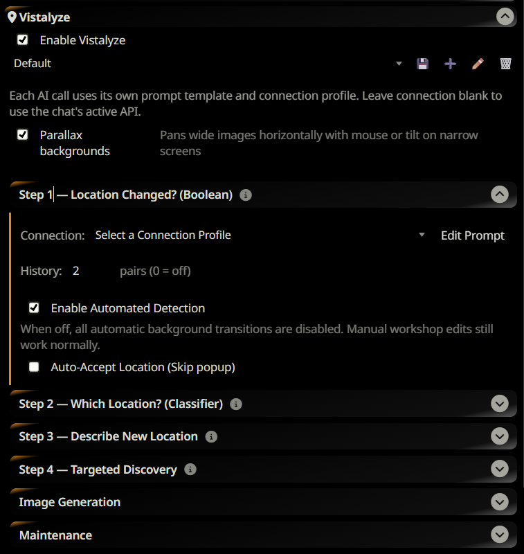
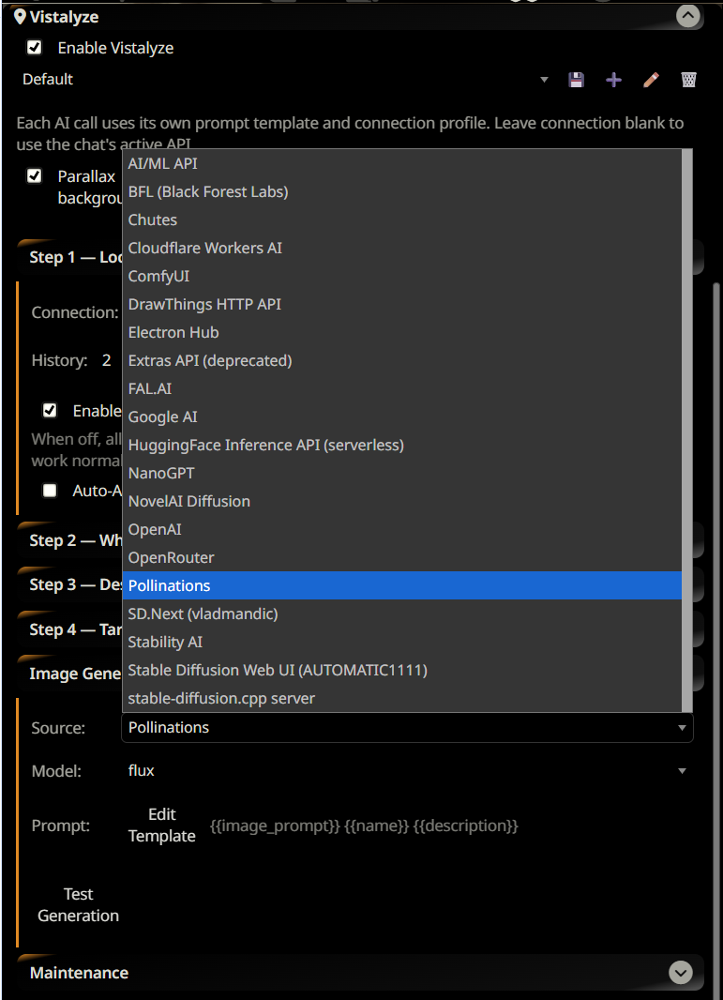

# 📍 Vistalyze

**[Released]**

**Vistalyze** is a SillyTavern extension that brings your roleplay to life by automatically detecting location changes and generating cinematic background images through SillyTavern's built-in Image Generation extension.

## 🔑 Setup & Requirements

Vistalyze delegates all image generation to SillyTavern's native **Image Generation** extension (the "stable-diffusion" extension bundled with ST). This means:

- **No `allowKeysExposure` required** — API keys are read server-side and never exposed to the browser.
- **Any ST-supported image provider works** — Pollinations, FAL.AI, OpenAI, Stability AI, BFL, xAI, Together AI, and more.
- **Keys are managed in one place** — configure your provider key once in ST's Image Generation panel; Vistalyze uses it automatically.

### Quick Setup

1. **Image provider**: Open ST's **Image Generation** settings (Extensions panel → Image Generation) and configure your preferred provider and API key.
2. **LLM connections**: In the Vistalyze settings panel, assign an LLM to each detection step (see model guidance below).
3. **Image source in Vistalyze**: Under **Image Generation** in Vistalyze settings, select the same source you configured in ST and pick a model. Use **Test Generation** to confirm everything is wired up.

---

## 🚀 Quick Start Guide

1. **Installation**: Place the `SillyTavern-Vistalyze` folder into `SillyTavern/data/default-user/extensions/` (or install via the ST extension manager).
2. **Image provider**: Configure your API key in ST's **Image Generation** extension settings.
3. **Vistalyze image settings**:
   - Open the Vistalyze settings panel (Extensions → Vistalyze).
   - Under **Image Generation**, set **Source** to match your ST image provider.
   - Select a **Model** from the live list, or type a model name for providers without a discovery endpoint.
   - Click **Test Generation** to confirm the connection.
4. **LLM steps**: Assign connection profiles to the four detection steps. Leave blank to use the chat's active API.
5. **Chatting**: Start roleplaying. When your character moves somewhere new, Vistalyze detects the transition, asks for confirmation, and generates a background automatically.

---

## 🎨 Image Generation Sources

Vistalyze runs image generation independently from ST's chat image generation — changing the source in Vistalyze does not affect your `/imagine` commands and vice versa.

Supported cloud sources (model list fetched live):

| Source | Notes |
| :--- | :--- |
| **Pollinations** | Free tier available; good default for getting started |
| **FAL.AI** | Fast FLUX-based models |
| **Together AI** | Wide model selection |
| **Chutes** | Open-source model hosting |
| **ElectronHub** | Pricing shown per model |
| **NanoGPT** | Credits-based |
| **AIMLAPI** | Large catalogue |
| **OpenRouter** | Routes to many providers |

Sources with a fixed model list (type the model name manually):

`Stability AI` · `BFL (FLUX)` · `OpenAI (DALL-E / GPT-Image)` · `xAI (Grok)` · `Z.AI` · `HuggingFace`

Sources requiring a **local server** are not supported for background generation:

`Auto (A1111)` · `SD.cpp` · `ComfyUI` · `DrawThings` · `Horde` · `NovelAI` · `Extras`

---

## ⚙️ Configuration & Best Practices

Vistalyze uses a 4-step pipeline to manage background generation. To optimise for speed and cost:

| Step | Function | Recommended Model | Why? |
| :--- | :--- | :--- | :--- |
| **Step 1** | Location Changed? | Fast/cheap (e.g. Mistral Small 2503) | Runs on every AI message — boolean YES/NO only |
| **Step 2** | Which Location? | Mid-tier (e.g. Gemini Flash Lite) | Matches against known locations |
| **Step 3** | Describe New Location | Mid-tier (e.g. Gemini Flash Lite) | Writes the visual prompt for generation |
| **Step 4** | Targeted Discovery | Mid-tier (e.g. Gemini Flash Lite) | Keyword-guided new location creation |

> [!TIP]
> Each step can use a different LLM and connection profile. Leave the connection blank to fall back to the chat's active API.

---

## 🛠 The Location Workshop

Located in your top toolbar, the **Workshop** is your command center for managing the spatial DNA of your story. It is divided into three tabs:

- **Library**: View every location your characters have visited. Click the arrow to jump back to a previous location instantly.
- **Architect**: Edit a location's name, logical definition (for the AI), or visual description (for the image generator). Use **Thumbnail Preview** to check changes at low cost before finalising.
- **Explorer**: Use **Force Detect** if the AI missed a transition, or provide keywords (e.g. "A futuristic laboratory") to guide the AI's imagination.

---

## 🧠 How It Works

Every AI message triggers a short cascade of LLM calls. Each step only runs if the previous one indicates it is needed:

1. **Has the location changed?** A fast boolean check on every message. If no, the pipeline stops — no further calls are made.
2. **Is this location already known?** If a change is detected, a classifier checks whether the new location matches one already in your library. If it does, that entry is applied and the pipeline stops.
3. **Describe the new location.** Only runs for locations that are genuinely new. The AI writes a visual description, which is used as the image generation prompt.

Background generation uses a **Two-Write Pattern**: the location transition is recorded immediately, the image is generated asynchronously, and the record is patched once the file is safely on disk. If a generation fails, it is automatically retried next time you open the chat.

---

## 🛡 Data & Privacy

- **No external databases**: Locations, descriptions, and history are stored inside your chat log (`.jsonl`) file.
- **Fork-safe**: Duplicate or move a chat and the entire location history moves with it.

---

## 🎨 Visual Features

- **Parallax Effect**: Enable in settings to make wide backgrounds respond to mouse movement or phone tilt.
- **Message Badges**: Every AI message shows a location icon. Click it to retroactively change the location for that moment.
- **Re-run Badge**: Enable the optional `?` icon on badges to manually re-trigger the full detection pipeline on any message.
- **Self-Healing**: Missing background images are automatically re-queued on the next chat load.

---

## ❓ Troubleshooting

- **Test Generation failing?** Check that your API key is saved in ST's Image Generation extension and that the Source and Model in Vistalyze match.
- **"Unsupported source" error?** Local sources (A1111, ComfyUI, etc.) require a running local server and are not supported for background generation. Switch to a cloud provider.
- **Orphaned images?** Use **Audit Images** in Vistalyze settings (Maintenance section) to find and delete background files from deleted chats.
- **LLM failing?** Step 1 can use a very small, cheap model. Steps 2–4 run less frequently but benefit from a more capable model.

